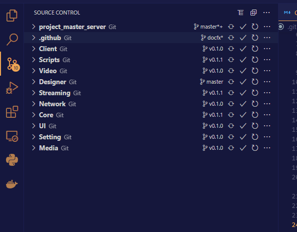

# Funique Hub Quick Start

## Installation
In the project folder

```bash
git init
git submodule add --force --branch v0.1.1 "https://github.com/Funique2022/funique_hub.git" "Assets/FuniquePlugin/Hub"
```

## Module Loading


Select the desire module and click Load button to import\
Or you can choose manually import the module.

```bash
git init
git submodule add --force --branch [Branch_Name] [Git_URL] [Target_Folder]
```

## Module Git Manager

Switch to git management page.\
This will scan all the used submodule and manage their git pipeline.


### Alternative

[Visual Studio Code](https://code.visualstudio.com/)

Visual studio code also provides module scan and management

