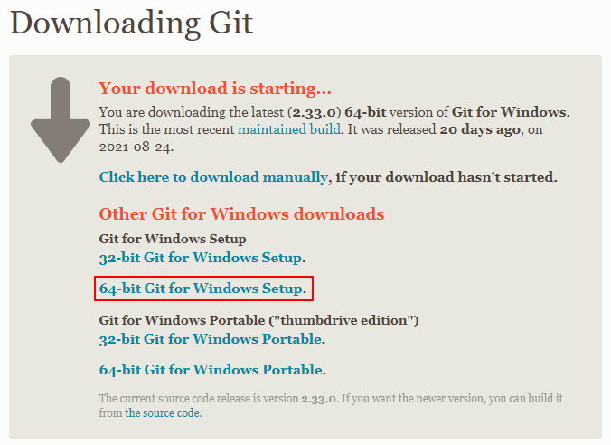
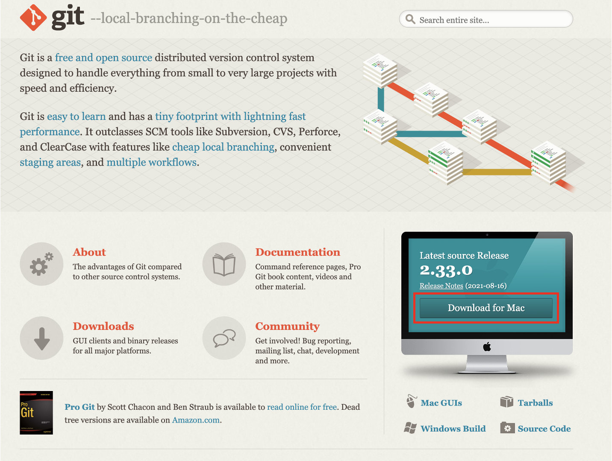
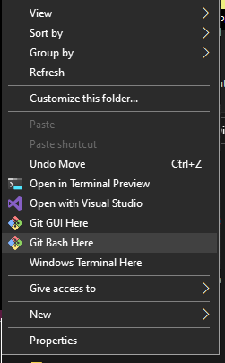
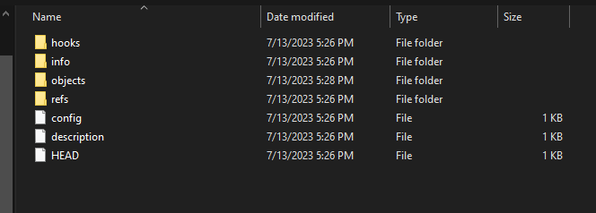
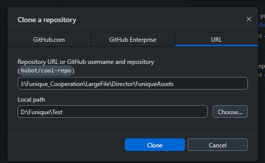
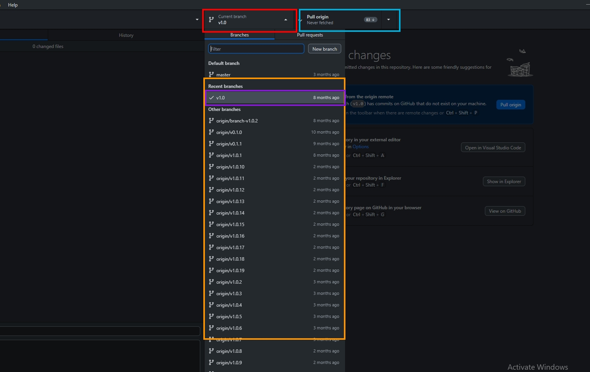
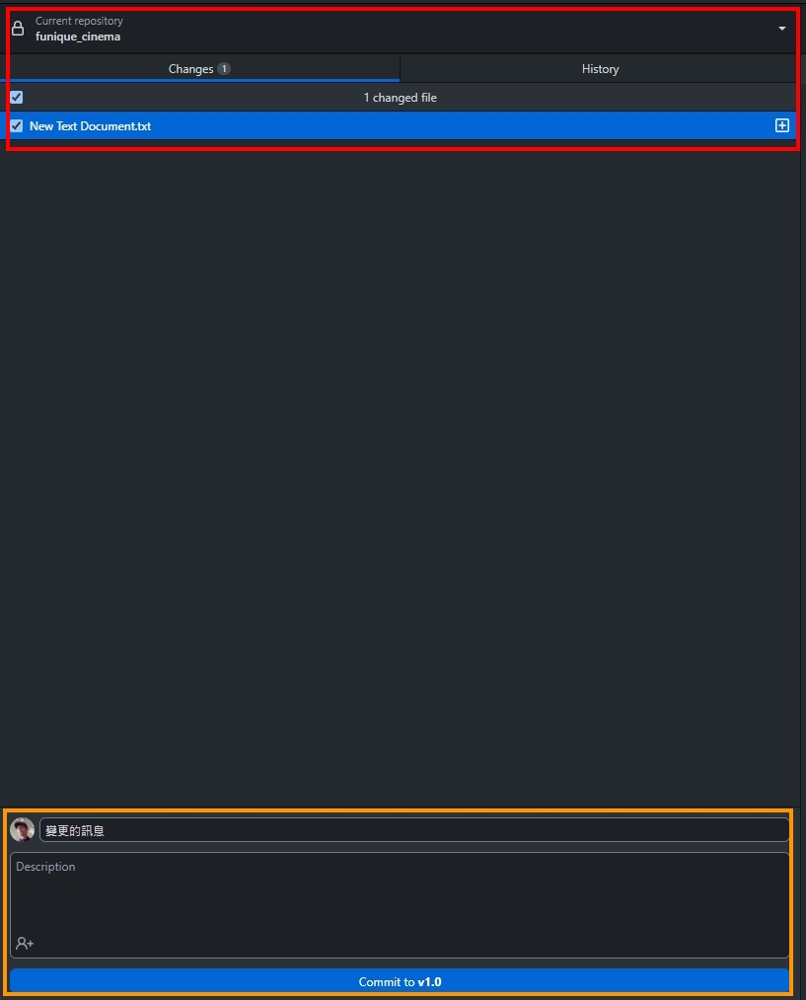

# 版本控制

為了能建立版本控制的美術資源, 取代舊有複雜命名規則的檔案架構. 這邊會使用 Local Git 作為方案

## 安裝

[git 工具](https://git-scm.com/)





安裝過程就是開自動點擊外掛 點滿滿的下一頁按鈕ww

[GUI 版本控制工具](https://desktop.github.com/)

## 建立資源

在磁碟的 NAS 槽, 在理想要放置美術資源的地方, 資料夾右鍵



輸入指令

```powershell
git init --bare --shared=group
```

這個指令會使資料夾生成以下的結構, 此結構就是版本控制的 git 目錄. 在這邊資料會以壓縮的方式保存, 並且保留所有版本紀錄跟分支. 這使得程式組能快速切換新的版本進行更新.



## 上傳檔案

開啟 Github Desktop, File -> Clone Repository



* Repository URL => 輸入 NAS 上資源的位置
* Local path => 請輸入本機電腦位置, 這個位置會作為樞紐上傳

確定後點擊 Clone 開始同步的動作, 接著會直接選擇這個 Repo (資源處)



* 紅色: 分支
* 橘色: 其他分支
* 藍色: 變更動作
* 紫色: 現在選擇的分支

> [!WARNING]
> 必須要注意每個使用者的習慣不一樣, 使用者可能在加入 NAS 連接的方式是使用磁碟標籤, 有些使用者則是直接用 URL. 這些都會影響拉不拉的到資源. 所以在給予連結的時候一定要注意 URL 前綴.

處裡檔案上傳:



* 紅色: 變更的內容
* 橘色: 變更的留言

變更完後點擊 Publish 或 Push 即可上傳

## 使用情境

假如我在 Z:/Test/UI_Resource 生成了一個資寮配置處, 我就直接把這個連結給程式組. 上傳了一份我做完的 UI 到分支 v1.0 並且將分支告知程式組. 程式組會拉下資源同步, 結束.

第二次更新 UI 時. 美術組新增新的分支 v1.1, 並且檔案直接覆蓋, 確認變更, Push (上傳上去), 再通知程式組 UI 變更成 v1.1 即可.

## 術語

#### Repository

Git 的專案, 講白話就是這樣, 像是專案資料夾的存在.

#### Branch

分支, 像是路線

#### Pull

從目前的分支, 把變更的資源拉下來統整到你的本機資料夾中.

#### Push

把你本機資料夾的變動, 更新到分支上.

#### Publish

建立新的分支
