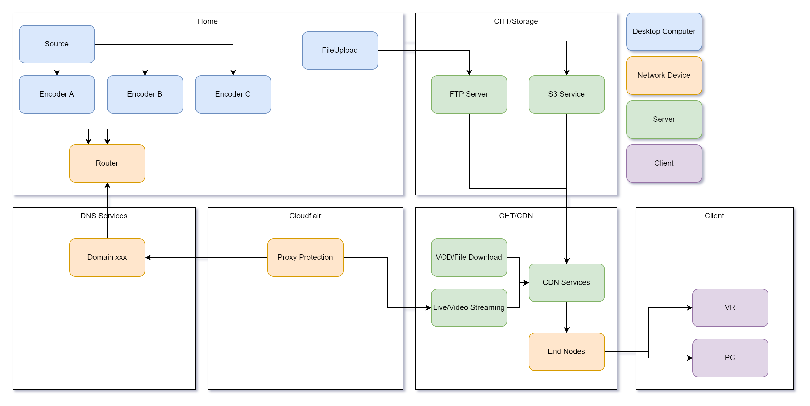

# Funique 文件指南 For 雲端管理者

雲端的管理部分, 使用了許多的第三方服務, 在複雜錯綜的結構下要釐清脈絡需要一定程度的簡易視覺化.

以上為用最粗略的方式繪製出直播與影片串流的脈絡

而原宇宙的脈絡則是更為複雜

以下為前台以及商模的設計

[Miro 商模大架構](https://miro.com/app/board/uXjVOYp2zDc=/)

[元素 Breakdown](https://app.diagrams.net/#G1bJgeV2ls-_twaoIS5sxyEM5Pq3qgadko)
