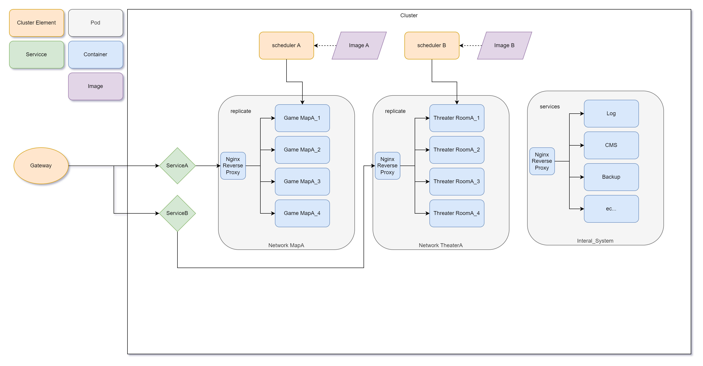

# 微服務設計

目前設計是採用撰寫服務部屬在各個平台

Firebase, Lightsail, EC2, Google, 外包平台, Etc...

> [!TIP]
> 可以使用 Caas 容器服務管理進行統整/維護/更新

一些有用的學習文件

* [Docker Swarm](https://docs.docker.com/engine/swarm/)
* [Portainer](https://docs.portainer.io/start/intro)

想法是可以開多個實體在 EC2 或是 Lightsail 上, 每個實體都必須是 Linux 基底然後需要有安裝 Docker. 在多個實體間選擇一個 Master 進行資源的管理

以下為在 Web 上能看到的頁面, 可以一個列表下來看到有多少服務在線上, 並且可以隨時更新, Shell 作業.

以下為簡易的微服務的架構

可以製作一個 Scheduler 銜接 Docker 的環境生成實體, 刪除實體, 來達成遊戲伺服器多開的作用.