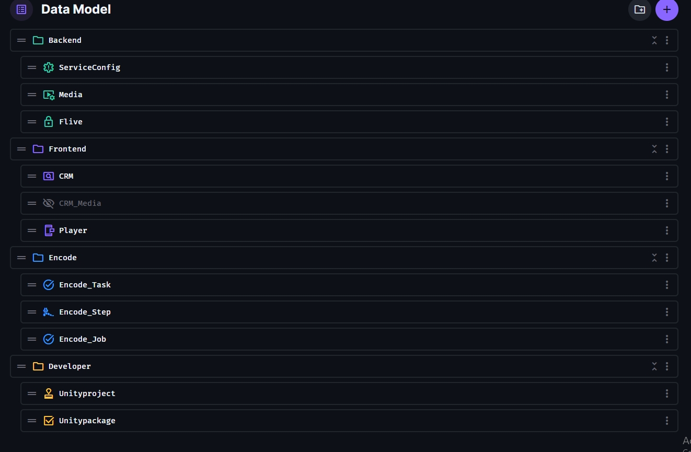

# Directus

Directus 是開源的 CMS 框架, 並且有提供自行架設的方案.

[官方網站](https://directus.io/)
[文件指南](https://docs.directus.io/reference/introduction.html)

[伺服器連接](http://satellite.funique.tv/directus)

> [!TIP]
> 目前的分類還算是粗略的

* Backend 後台資料 (系統後台應用)
* Frontend 客戶端資料 (客戶端偏好或是關係應用)
* Encode 編碼資料 (影片編碼轉碼應用)
* Developer 開發者資料 (開發人員專用資料)

