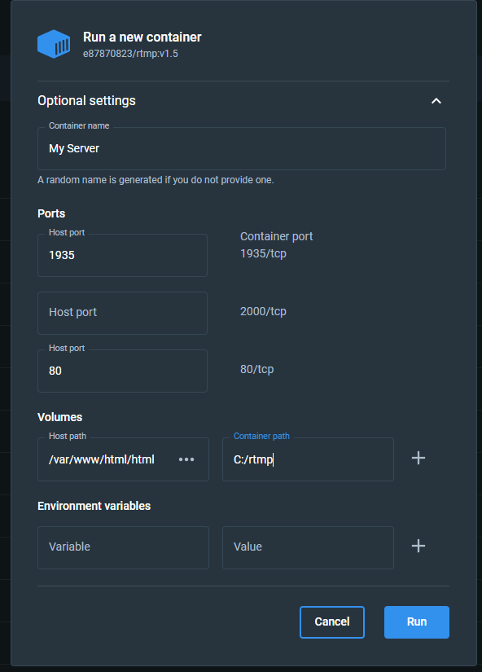

# 架設串流伺服器

[映像檔案](https://hub.docker.com/r/e87870823/rtmp)

映像檔使用 Ubuntu 18.04 LTS, 如果你使用 Windows 你可以使用 WSL2 Docker

# Windows 安裝

## 啟用 windows WSL

Powershell 並且輸入

```powershell
dism.exe /online /enable-feature /featurename:Microsoft-Windows-Subsystem-Linux /all /norestart
dism.exe /online /enable-feature /featurename:VirtualMachinePlatform /all /norestart
```

## Docker 環境設定

在第一步驟完成後，你可以開始安裝 Docker

[安裝 Docker](https://www.docker.com/)

完成安裝後 切換版本至 WSL 2

```powershell
wsl --set-default-version 2
```

恭喜，你有了 Docker 在 Windows 環境下

## 安裝串流伺服器服務

### 指令安裝

```powershell
docker run -d --name rtmp -p 80:80 -p 1935:1935 -v /var/www/html/html/res://c/Users/myusername/Desktop/Test e87870823/rtmp:v1.5
```

### GUI 安裝

先用指令拉取 Image 再生成 Container

```powershell
docker pull e87870823/rtmp:v1.5
```



> [!WARNING]
> You should enter a exist folder for container path !!

# Ubuntu 安裝

```shell
sudo apt-get update
sudo apt-get install ca-certificates curl gnupg
sudo install -m 0755 -d /etc/apt/keyrings
curl -fsSL https://download.docker.com/linux/ubuntu/gpg | sudo gpg --dearmor -o /etc/apt/keyrings/docker.gpg
sudo chmod a+r /etc/apt/keyrings/docker.gpg
echo "deb [arch="$(dpkg --print-architecture)" signed-by=/etc/apt/keyrings/docker.gpg] https://download.docker.com/linux/ubuntu "$(. /etc/os-release && echo "$VERSION_CODENAME"" stable" | sudo tee /etc/apt/sources.list.d/docker.list > /dev/null
sudo apt-get update
sudo apt-get install docker-ce docker-ce-cli containerd.io docker-buildx-plugin docker-compose-plugin
```