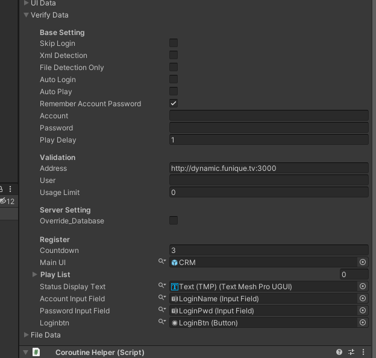
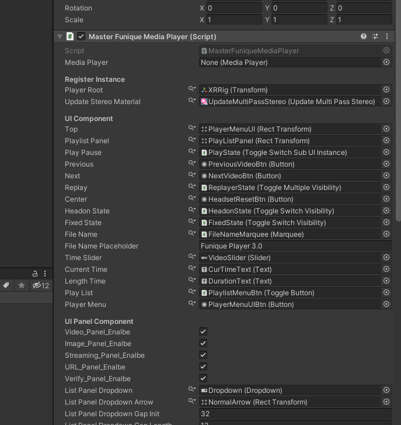

# Manager Setup Guide

We're combine all the necessary manager in a scene to a single script to handle the data for it.

Usually it's called Main.cs\
And it will contain the manager require config data fields

For example\
If you want to change the verify part of logic, and could just open the verify config tab and modify the data and save it. 
No need to change scene structure or modify multiple component in the different place.

Not all the configuration are in the main component, actually. 
This just combine the global manager config setting fields together.

For example\
If you want to change the behaviour of the client-side cinema media player, you still have to go the target scene object, and modify by youself.
