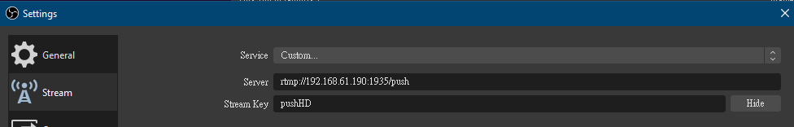

# Push Video Stream

[Image Website](https://hub.docker.com/r/e87870823/rtmp)

Most of URL use are in the readme file

Use [OBS](https://obsproject.com/) as example 

In the setting panel -> Stream

Server -> Server Address
Stream Key -> The last part of URL

For the above example the URL will become like this

rtmp://192.168.61.190:1935/push/pushHD

Then you can found the URL utility in the image website

url prefix will determine the feature you want to use

* push -> no transcode, store rtmp video stream only
* live -> all format, auto transcode
* live_t -> ts format, auto transcode
* live_m -> m4s format, auto transcode
* live_d -> dash format, auto transcode

Then the outcome will be like

* http://192.168.61.190:80/hls/pushHD.m3u8
* http://192.168.61.190:80/mp4/pushHD.m3u8
* http://192.168.61.190:80/dash/pushHD.m3u8

If you want to manually transcode, use push prefix and use ffmpeg transcode youself

You should produce files in your link RTMP folder, so you can call it like below

* http://192.168.61.190:80/res/custom_stream.m3u8
