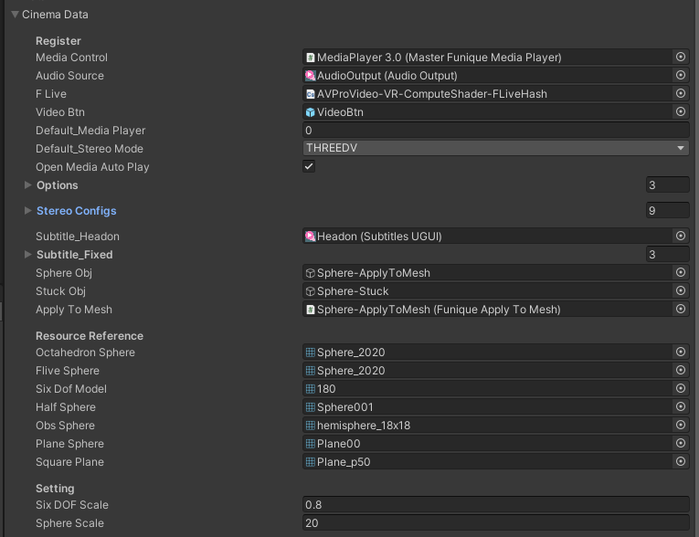
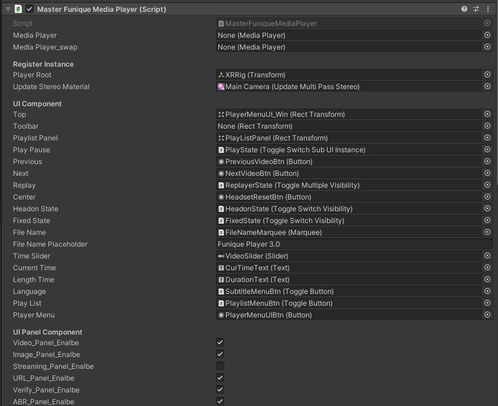

# Cinema Logic Qucik Start

Create a class inherit cinema server manager

## Configuration

check cinema data section



* Media Control -> Targeting the media player ui controller

If you follow the component you will see a much more detail UI controller component. We recommand you not touch this component, unless you know what you are doing.



* Audio Source -> AvPro audio output
* FLive Compute Shader for decoding (deprecated)
* VideoBtn -> Menu use element button (deprecated)
* Default_Media Player -> Assign this index of media player by default
* Default_Stereo Mode -> Assign this stereo when we have no idea what stereo the source is
* Options -> AvPro Media Player list
  * Name -> Just for name, no effect for code
  * Meta -> Hmmm, 
  * Support_Swap -> Support smooth transition, It must assign second media player
  * Target -> AvPro media player instance
* Stereo Config -> The UV layout and material manipulate config
  * Mode -> The use mode

## Writing Your Own Implementation

```csharp
// Writing your own manager
public class CinemaClient : CinemaManagerClientUtility {

}
```

In the main component, you could modify the class or

```csharp
public class Main : MonoBehaviour {
    // Explose the config to editor level, provide desginer to tweek the value
    [SerializeField] CinemaManagerClientData data;
    // Our manager instance
    CinemaClient cinema;

    void Start(){
        // Create cinema server manager process
        cinema = new CinemaClient();
        cinema.RegisterConfig(data);
    }

    void Update(){
        cinema.FrameUpdate();
    }
}
```

You could override a main

```csharp
public class Main_Second : Main {
    // Explose the config to editor level, provide desginer to tweek the value
    [SerializeField] CinemaManagerClientData data;

    CinemaClient _CinemaClient;
    public override ICinema CinemaManager => _CustomCinemaManager;

    // You can override the default init manager behaviour
    protected override void InitManager(){
      _CinemaClient = new CinemaClient(); // Switch default cinema to ours
      _CinemaClient_.RegisterConfig(CinemaData);
      _XRManager.RegisterConfig(XRData);
      _UIManager.RegisterConfig(UIData);
      _VerifyManager.RegisterConfig(VerifyData);
      _FileManager.RegisterConfig(FileData);
      _AndroidManager.RegisterConfig(AndroidData);

      _VerifyManager.OnLogin.AddListener(() =>
      {
          _NetworkManager.Initialization();
      });

      Main.Managers.ToList().ForEach(x =>
      {
          if (x.GetType() != typeof(NetworkManager))
              x.Initialization();
      });
      (NetworkManager as NetworkManager).Initialization();
    }
}
```

For API detail, check here

[API Reference](../../../api/Funique.Cinema.ICinemaClientUtility.html)
