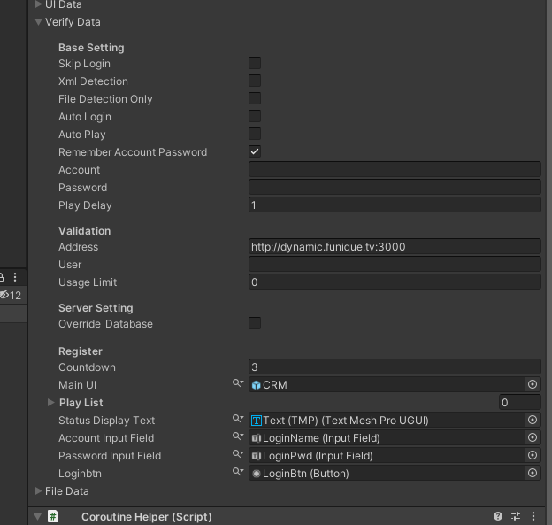

# 管理者快速開始

> [!NOte]
> 繼承前言, 我們能在 Demo 場景中找到 Main 元件掛載在 GameManager 頂層遊戲物件上

> [!NOTE]
> 這主要是各個模組元件的配置結構\
> 會將所有的模組元件列出來, 以下圖為例子. 這個管理員至少掛載了 UI, Verify 的模組\
> 打開 Verify (認證的元件), 就可以修改配置

> [!TIP]
> 你可以在不改變場景結構的狀況下, 影響程式的運作行為.\
> 這種設計上會比較複雜, 但是自由度是非常的高\
> 如, 想要直接跳過 CRM 的認證登入, 直接勾選 Skip Login, 剩下的交由底層邏輯去判斷

