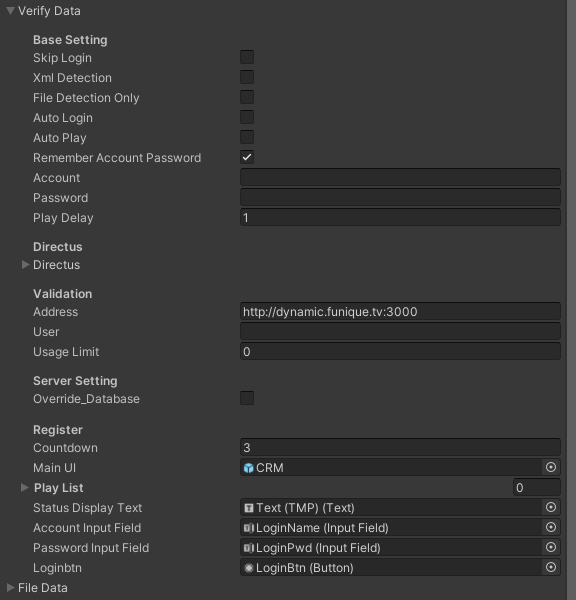

# 認證快速開始

## 配置

* Skip Login -> 直接跳過登入 (測試)
* Xml -> 開啟偵測 XML 功能
* File Detection Only -> 只會偵測 XML 檔案
* Auto Login -> 自動登入
* Auto Play -> 自動播放
* Remember -> 記住登入資訊至作業系統機碼 (Windows)
* Account -> 預設帳號
* Password -> 預設密碼
* Play Delay -> 播放延遲
* Directus -> 新型 CRM 位址
* Address -> 舊式 CRM 位址
* User -> 舊式 CRM 帳號
* UserLimit -> 用戶上限
* Countdown -> 登入倒數
* MainUI -> CRM UI 視窗