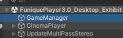

# Funique 客戶端元件

Here is a list of modules that contain client use logic\
This include received information from server, analysis network packages\
Media player logic or scene or character movement, etc...

In this documentation, we will show you how to apply the components and even override its methods in order to make it works.

| ID  | Name                                                                | Docuemnt                                         |
| --- | ------------------------------------------------------------------- | ------------------------------------------------ |
| 1.  | [Cinema](https://github.com/Funique2022/funique_cinema.git)         | [Quick Start](./Client/Cinema/QuickStart.md)     |
| 2.  | [Client](https://github.com/Funique2022/funique_client.git)         | [Quick Start](./Client/Client/QuickStart.md)     |
| 3.  | [Dissonance](https://github.com/Funique2022/funique_dissonance.git) | [Quick Start](./Client/Dissonance/QuickStart.md) |
| 4.  | [Monitor](https://github.com/Funique2022/funique_monitor.git)       | [Quick Start](./Client/Monitor/QuickStart.md)    |
| 5.  | [Network](https://github.com/Funique2022/funique_network.git)       | [Quick Start](./Client/Network/QuickStart.md)    |
| 6.  | [Setting](https://github.com/Funique2022/funique_setting.git)       | [Quick Start](./Client/Setting/QuickStart.md)    |
| 7.  | [UI](https://github.com/Funique2022/funique_ui.git)                 | [Quick Start](./Client/UI/QuickStart.md)         |
| 8.  | [Verify](https://github.com/Funique2022/funique_verify.git)         | [Quick Start](./Client/Verify/QuickStart.md)     |
| 9.  | [Video](https://github.com/Funique2022/funique_video.git)           | [Quick Start](./Client/Video/QuickStart.md)      |
| 10. | [AD](https://github.com/Funique2022/funique_ad.git)                 | [Quick Start](./Client/AD/QuickStart.md)         |

[Back To Intro](./intro.md)

## Basic Start

Open any demo scene and find GameManager object in hierarchy

And check main component

This is the primary configuration component, You modify any value here it will effect the whole application work mode.

Everything should be setup already, Unless you have reason or you know what you're doing, do not touch other gameobject.

