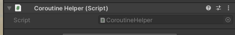

# 協程幫助

幫助那些需要用到 MonoBehaviour 協程的類別與函式



使用方法如下

```csharp
class SampleA {
    void Use(){
        Coroutine coroutine = CoroutineHelper.Instance.Run(Go);
    }

    IEnumerator Go(){
        yield return new WaitForEndOfFrame();
    }
}
```