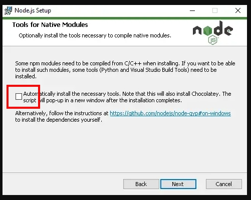
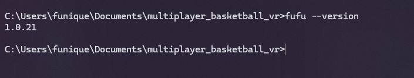

# 安裝

首先 我們必須架設好 Node.js + NPM 環境才能使用 Fufu

[Node.js](https://nodejs.org/en)

在安裝的過程記得勾選 自動安裝必須的第三方工具



等全部安裝好了後, 如果鍵入以下指令至 CMD 中會顯示 Node js 版本\
則代表成功的安裝環境了

```powershell
node --version
```


確認環境建立後在 CMD 打入此指令安裝 Unity 專案管理工具

```powershell
npm i -g unity_package_manager
```

如果以下指令會顯示版本, 則是成功了

```powershell
fufu --version
```



可以直接打入 fufu 獲得詳細 CLI 的訊息

```powershell
fufu
```


