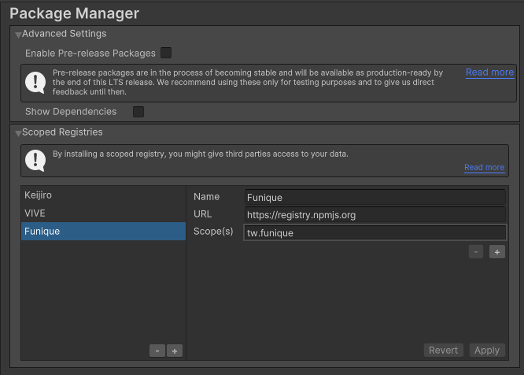
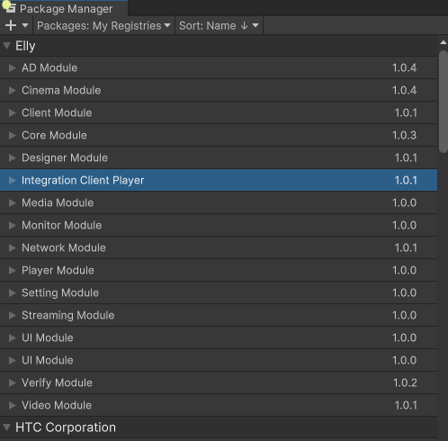
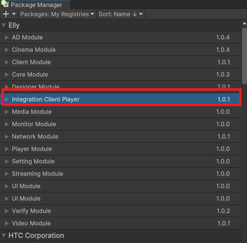

# Install The Package

## Use Package Manager

Project Setting -> Package Manager

Enter the funique package registery information

Name: Funique\
URL: https://registry.npmjs.org\
Scope: tw.funique

Then you should be enable to see the list in the package manager window

Windows -> Package Manager -> My Registery

## Quick Setup Project

>> [!WARNING]
>> You should already install the latest version of the package prevent debug happening.

Find the package name start with integration, It will pull all the package dependencies from modules

But even if we pull the project require modules, There still something missing. Yes, the project primary scene.

After pull the integration package you should be enable to see the simples scene like below screenshot.

>> [!NOTE]
>> It is normal to restart the project during the installation, you might install the module that require restart.
