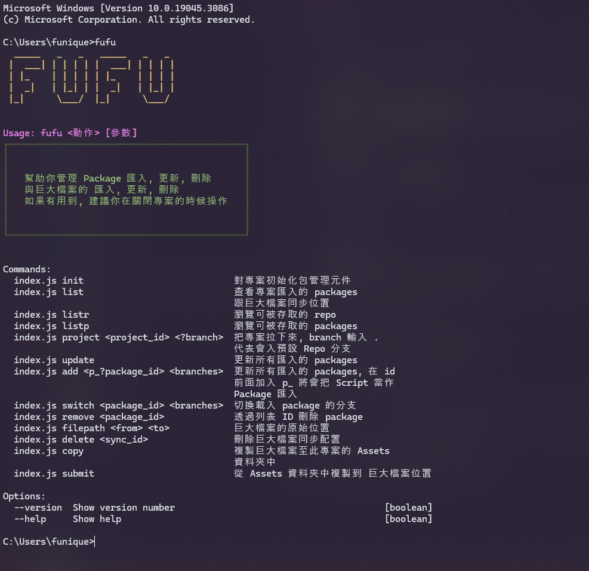

# 架設

在這一篇中, 你可以了解專案架構

## 第三方工具幫助
[Git](https://git-scm.com/downloads)\
[Github Desktop](https://desktop.github.com/)\
[Funique_Package_Manager](https://www.npmjs.com/package/unity_package_manager)

## 架構


這是主要的專案架構

統整(Integration) (主要邏輯) 會保存在 `/Assets/Scripts`\
模組(Modules) (通用邏輯) 會保存在 `/Assets/FuniquePlugin/[Module Name]`\
媒體, 巨大檔案(忽略元件) 會保存在 `/Assets/FuniqueAssets`

這樣可以確保

模組的載入行為批次檔案都會在根目錄


> [!WARNING]
> 當專案的依賴性改變之時, 便要手動更改根目錄批次檔案, 否則下一個人將會下載錯誤的依賴模組.

### 依賴性
每個模組都會有他的依賴性, 這些東西都會寫在模組的 readme.md 上


### NPM 工具

下載 Unity 專案管理工具到系統全局環境中

```powershell
npm i -g unity_package_manager
```

直接在指令打 fufu 便可以獲得 CLI 使用指南



使用 listr 參數

