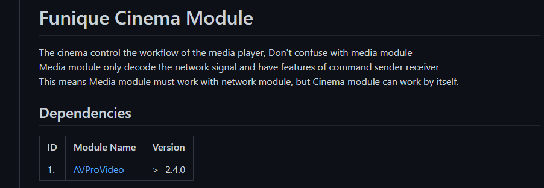

# 架設

在這一篇中, 你可以了解專案架構

## 第三方工具幫助
[Git](https://git-scm.com/downloads)\
[Github Desktop](https://desktop.github.com/)\
[Funique_Package_Manager](https://www.npmjs.com/package/unity_package_manager)

> [!TIP]
> 你必須要下載 Git 才能使用專案管理工具

## 手動架設

> [!WARNING]
> 此為手動架設的流程, 新的專案現在使用 Fufu 版本管理工具, 則不再提供批次檔案.

### 使用 Git 專案

在 [Github 組織](https://github.com/Funique2022) 下尋找 project 開頭的 repository


> [!WARNING]
> 你必須要有 Github 組織的權限才可以拉取專案. 如果尚未加入請至於開發團隊申請

Clone 到你的資料夾, 以下為範例

```powershell
# --branch 為指定分支, 如果不打的話則會拉取預設的分支
git clone https://github.com/Funique2022/project_funique_player.git --branch v1.0
```

branch 為現在要選取的版本號

或是使用 [Github Desktop](https://desktop.github.com/) 進行拉取動作


在根目錄尋找批次檔案


* load 下載所有子模組
* remove 刪除所有子模組
* update 更新所有子模組

> [!TIP]
> 新的專案則是使用 fufu update 來取代批次檔案

### 有些專案是需要資源的匯入 才會使其成立

這些資源不會放在 git 的上面, 主要原因是因為容量的限制. 這些會放在 NAS 上的 資源資料夾中. 那現在就來手動匯入資源.

> [!TIP]
> 新的專案則是使用 fufu copy 複製 NAS 上的檔案下來

以下為範例的 NAS 路徑 (此路徑為動態的)


如圖 會根據專案名稱下有各種資源資料夾\
把這些資料夾丟到專案資料夾的 Assets 中即可

## 專案架構


這是主要的專案架構

統整(Integration) (主要邏輯) 會保存在 `/Assets/Scripts`\
模組(Modules) (通用邏輯) 會保存在 `/Assets/FuniquePlugin/[Module Name]`\
媒體, 巨大檔案(忽略元件) 會保存在 `/Assets/FuniqueAssets` 或其他路徑

> [!TIP]
> 要判斷插件要綁模組還是專案, 看個人. 範例
> 播放器可以綁模組, 撥放器通常會帶自定義的邏輯判斷, 綁模組也可以統一 Avpro 的版本. 比起綁定專案來說有十足的好處.
> BetterHTTP 相對來講就比較通用. 可以綁專案, 當然也可以像是建立 Web 名稱的模組, 然後再匯入.

這樣可以確保

### 依賴性
每個模組都會有他的依賴性, 這些東西都會寫在模組的 readme.md 上



### 重複使用

可以單獨用 git 匯入至多個專案, 使其可被重複使用. 避免過多複製代碼動作.

### 可被測試

單元測試, 簡單講.
