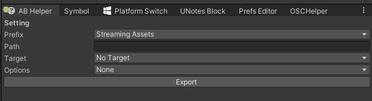
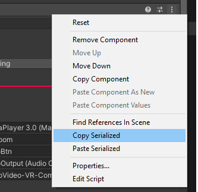
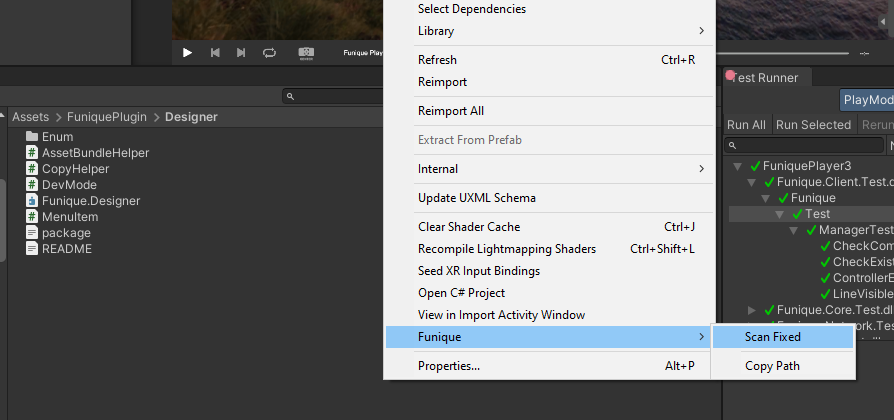
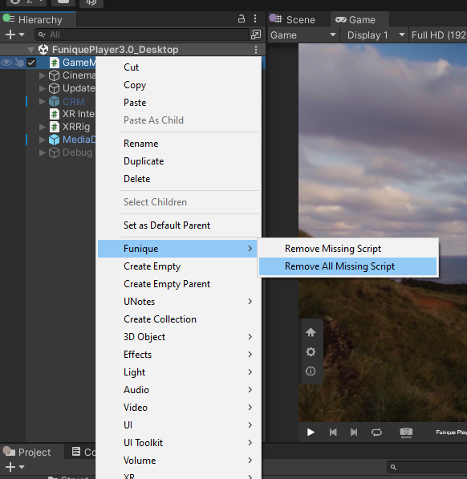

# 設計指南

設計指南主要是一堆 Editor 的工具 幫助重複性的行為, 像是 Bundle Package 的打包

一些加速開發人員的 Editor 工具

## Bundle 幫助

這個工具用幫助設計師打包 Unity 資源, 便利於之後動態載入

視窗位置

工具列 -> Funique -> Asset Bundle Helper 



* Prefix 輸出路徑位置
* Path 輸出相對路徑
* Target 平台目標 [詳細](https://docs.unity3d.com/ScriptReference/BuildTarget.html)
* Options 建置的一些 Flags [詳細](https://docs.unity3d.com/ScriptReference/BuildAssetBundleOptions.html)

按下輸出後, 將會把所有 Assets 裡面註冊的 Assets Bundle 輸出至上方輸入的資料夾內

## Unity 開發人員模式

這個項目幫助設計師開啟 Unity Editor 的開發人員模式, 可以調整底部 Unity 的數據, 在一些低層的 Debug 很好用.\
Inspect 會多出 Debug Internal 模式出來.

開關位置

工具列 -> Funique -> Dev -> On/Off

## 元件序列化剪貼

腳本元件的漢堡符號右鍵會多出兩個項目, 這個幫助於在不同的 Type 之間也能快速複製元件內容.



比如說我有兩個元件類別

```csharp
class A { int value; }
class B { int value; }
```

在預設的情況下是無法把 A 的數值複製到 B, 因為類別的不同. 但是序列化複製不一樣的地方是, 他是複製了數據內容的路徑, 所以可以進行套用.

## 掃描模型快速製作 Prefab

Assets 視窗在路徑按右鍵



會以這個路徑掃描子資料夾尋找模型檔案, 然後在 Assets 建立 Prefab 資料夾. 把模型做成 Prefab 套用 Material (獨立輸出) 丟進這個 Prefab 資料夾.

## 刪除遺失腳本

厭煩了 Missing Scripts 的錯誤?



這個項目可以直接把整個場景的遺失腳本刪除
