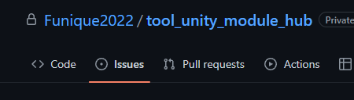
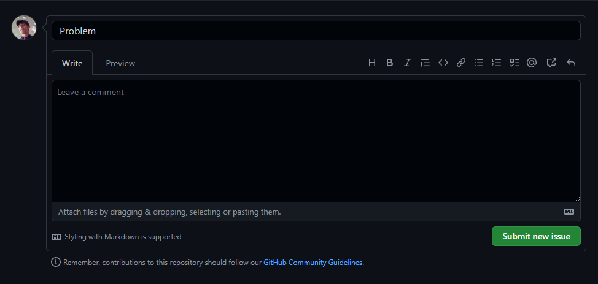

# Funique Documentation For User

In this documentation, you will see how to setup a unity project\
Inherit framework logic then Writing your own components\
And contribute help us improve our code quality

If you spot a bug or something want to report to dev, you can use the github issue feature\
You can find it in any project page

Post your issues there, we'll investigate them

## Architecture

The funique project has several strict rule apply on each project\
Before you start build a project, we recommend you read [this](./../stream/Intro.md) first

## Notice

Some modules has neutral part of mechanism which could applies to server side or client side, in this scenario we put these part at client side document.

## Tool Quick Start
[Funique Tool](./ToolGuide.md)

## Client Quick Start
[Funique Client](./ClientGuide.md)

## Server Qucik Start
[Funique Server](./ServerGuide.md)

